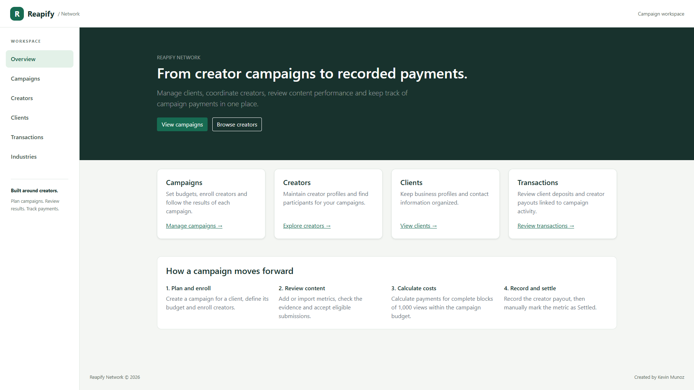
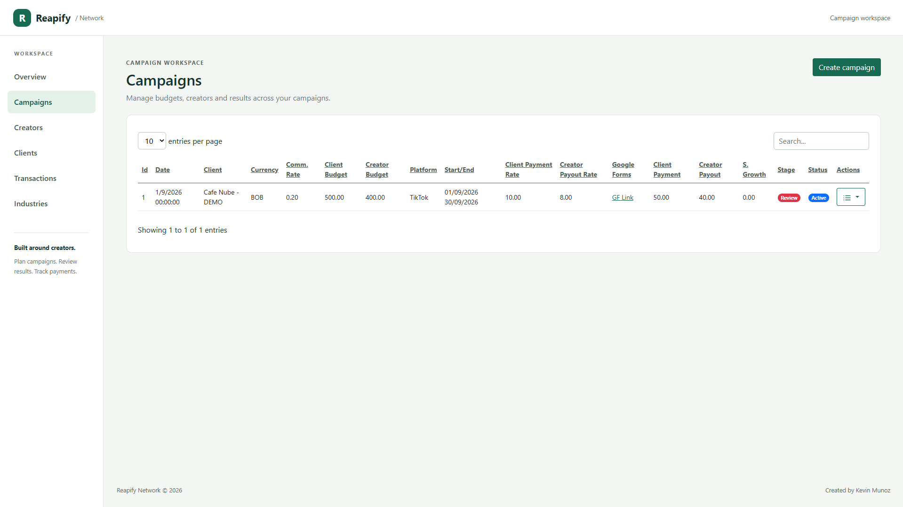
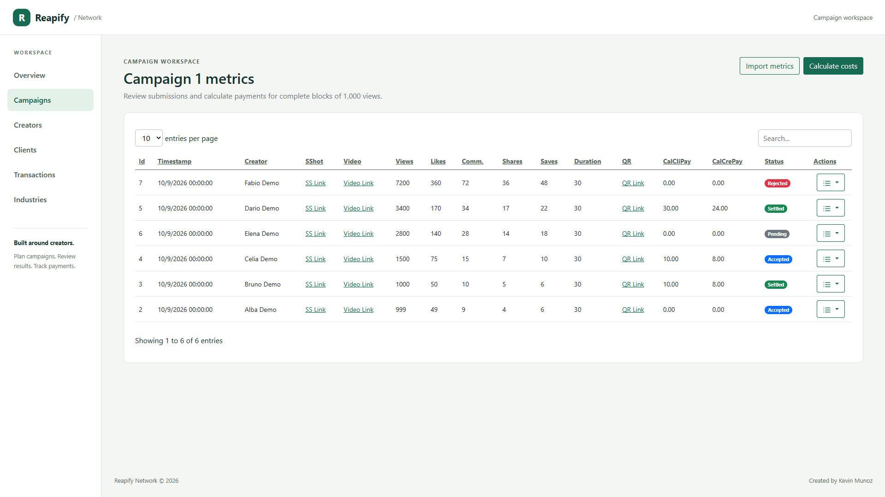
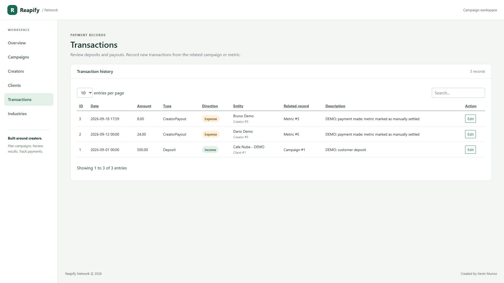
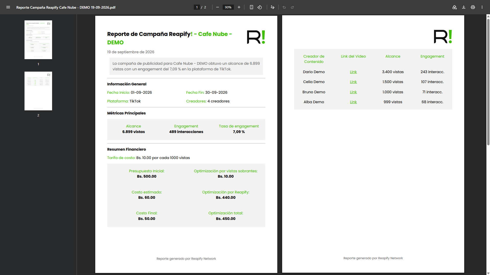

# Reapify

I originally developed Reapify as a creator campaign management system for my own business. It helps coordinate participants, review content performance, and record the payments associated with each campaign.

This portfolio version includes a demo database with fictional records. I created the Reapify name, logos, and brand identity.

## Features

- Manage clients, creators, and business sectors.
- Create campaigns with budgets, schedules, platforms, and payment rates.
- Enroll creators and review their metrics and supporting evidence.
- Calculate payments for complete blocks of 1,000 views within the campaign budget.
- Record deposits and payouts linked to campaigns or metrics.
- Import metrics from Excel and generate PDF reports.
- Prepare and send campaign messages through Discord webhooks using your own configuration.

## Screenshots

### Workspace overview

A central workspace for clients, creators, campaigns, and payments.

### Campaign management

Campaign budgets, schedules, and status in one place.

### Performance and payouts

Review content metrics and calculate payments within the campaign budget.

### Transaction history

Deposits and creator payouts linked to their related records.

### Campaign report

A generated PDF summarizing campaign performance and financial results.

## Technology and structure

ASP.NET Core MVC on .NET 8, Razor, Bootstrap, SQL Server, and Dapper. ClosedXML handles Excel imports, while QuestPDF generates reports. Edit view models use explicit mappings.

| Directory | Contents |
|---|---|
| `Advertisements/Controllers` | MVC actions and workflow coordination |
| `Advertisements/Models` | Entities, view models, and PDF composition |
| `Advertisements/Services` | Dapper repositories, payment calculations, and messaging |
| `Advertisements/Views` | Razor views and shared components |
| `Advertisements/wwwroot` | Styles, scripts, and static assets |
| `database` | SQL schema, stored procedures, and fictional seed data |

The solution retains the technical name `Advertisements`; the product is Reapify.

## Run the demo

### Requirements

- Visual Studio with ASP.NET support and .NET 8.
- SQL Server Express and SQL Server Management Studio (SSMS).

### Setup

1. Run [database/01-schema.sql](database/01-schema.sql), then [database/02-demo-data.sql](database/02-demo-data.sql) in SSMS to create and populate a new `Reapify_Portfolio_Demo` database.
2. Open `Advertisements.sln` in Visual Studio.
3. Adjust `ConnectionStrings:DefaultConnection` in `Advertisements/appsettings.Development.json` for your SQL Server instance. The default uses `.\SQLEXPRESS` with Windows authentication. For private credentials, copy `appsettings.Local.example.json` to `appsettings.Local.json`; this ignored file overrides the development connection.
4. Run the application using the `https` profile.

## Suggested walkthrough

1. Open **Campaigns** and find the **Cafe Nube - DEMO** campaign.
2. Use **View Enrollments** to see its participants and **View Metrics** to review their results.
3. Select **Calculate costs** and inspect the calculated amounts.
4. Record a payout for an accepted metric through **Create Transaction**.
5. Manually mark that metric as **Settled** and recalculate: its amounts are preserved.
6. Generate a report through **Export PDF Report**.

The demo's video, screenshot, form, and webhook URLs use `example.invalid`. They are placeholders, not working services. Testing Discord delivery requires your own webhook and sends an external message.

## Payment rules

The workflow is **review → accept → calculate → record payment → mark Settled**. Recording a transaction does not automatically change a metric's status.

- Only complete blocks count: 999 views = 0 blocks; 1,000 and 1,500 views = 1 block.
- Accepted metrics are processed by descending view count, with ascending ID as a tie-breaker.
- When an amount exceeds the remaining budget, it is capped at that balance, following the original business rule.
- `Settled` metrics retain their historical amounts. Their client cost is deducted before allocating the remaining budget and remains included in campaign totals.
- Recalculation is rejected if the settled client cost exceeds the budget.
- Amounts are rounded to two decimal places. Metrics and campaign totals are saved within a single SQL transaction.

### Initial demo dataset

Budget: **BOB 500**. Rate: **BOB 10 per block**. Commission: **20%**.

| Fictional creator | Views | Status | Client amount | Creator amount |
|---|---:|---|---:|---:|
| Alba Demo | 999 | Accepted | 0 | 0 |
| Bruno Demo | 1,000 | Accepted | 10 | 8 |
| Celia Demo | 1,500 | Accepted | 10 | 8 |
| Dario Demo | 3,400 | Settled | 30 | 24 |
| Elena Demo | 2,800 | Pending | 0 | 0 |
| Fabio Demo | 7,200 | Rejected | 0 | 0 |

The seed script creates one client, six creators, one campaign, six enrollments, six metrics, and two transactions. Initial totals are **BOB 50 for the client and BOB 40 for creators**; BOB 24 is recorded as paid and BOB 16 remains pending. The client deposit is BOB 500. These figures describe a fresh dataset before any demo changes.

## Scope and limitations

- Intended for local demonstration; authentication and roles are not implemented yet.
- `Settled` is assigned manually, without enforcing that a sufficient payment transaction exists.
- Some forms allow editing amounts and relationships. Further validation and antiforgery protection across all workflows remain to be implemented.
- Excel export is not implemented; metric import and PDF reports are available.
- Automated tests are not included.

## Ownership and licenses

The interface uses Bootstrap and custom styles.

See [THIRD-PARTY-NOTICES.md](THIRD-PARTY-NOTICES.md) for library and font notices, and the [NuGet inventory](licenses/NUGET-INVENTORY.md) for direct and transitive dependencies. Each dependency retains its own terms. I do not grant a general license for the Reapify source code; the brand and logos belong to me.

